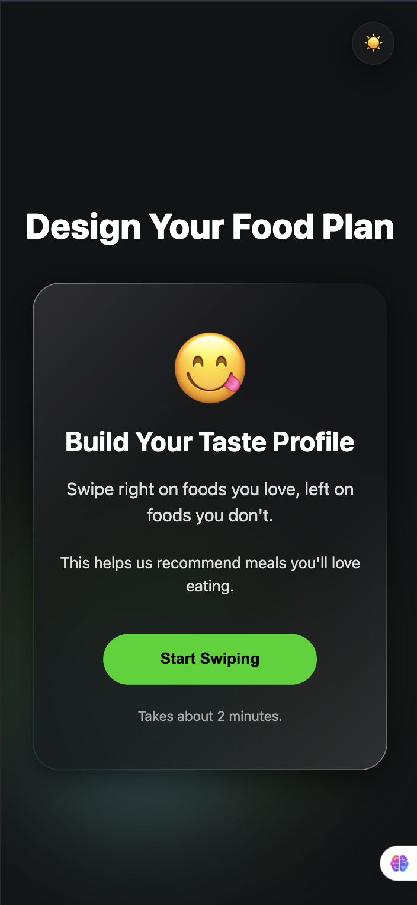
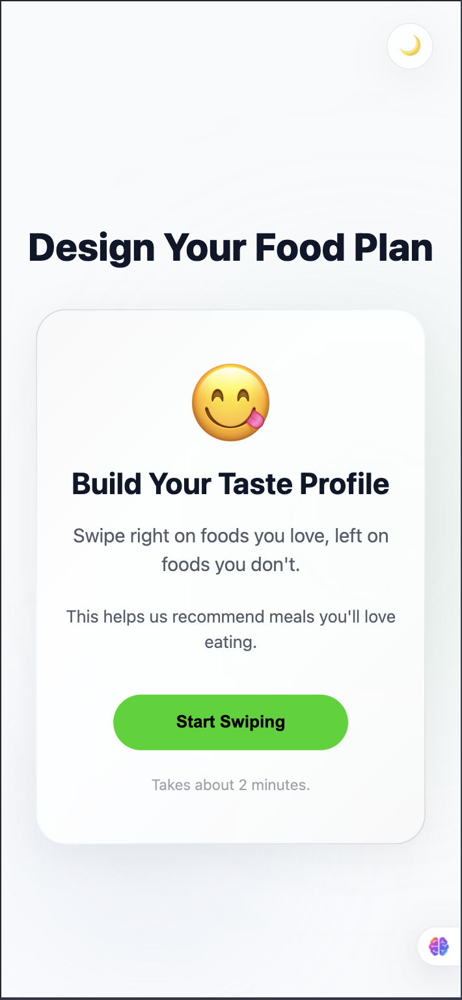

# CalorAI Taste Profile

**Live Demo:** [calorai-taste-profile.vercel.app](https://calorai-taste-profile.vercel.app)
**Video Walkthrough:** [Watch on Loom](PASTE_LOOM_URL_HERE)

---

## Screenshots

### Dark Mode


### Light Mode


---

## Component Architecture

Three page components (`IntroPage`, `SwipePage`, `ResultsPage`) rendered via **React Router** with animated transitions powered by Framer Motion's `AnimatePresence`.

Reusable UI primitives (`FoodCard`, `ProgressBar`, `ActionButtons`, `ThemeToggle`, `ListCard`, `HighlightsCard`, `GoalsCard`) are decoupled from state and receive only props. All leaf components are wrapped in `React.memo` to prevent unnecessary re-renders.

An `ErrorBoundary` class component wraps the entire app to gracefully handle render errors with a styled fallback UI.

```
src/
├── components/
│   ├── ui/          → ThemeToggle, ProgressBar, AnimatedBackground, ErrorBoundary
│   ├── cards/       → FoodCard, CardStack
│   ├── swipe/       → ActionButtons
│   └── results/     → HighlightsCard, ListCard, GoalsCard
├── context/         → ThemeContext, SwipeContext (Context API wrapper)
├── store/           → useSwipeStore (Zustand with persist middleware)
├── hooks/           → useSwipe, useTheme, useLocalStorage
├── pages/           → IntroPage, SwipePage, ResultsPage
├── utils/           → tasteAnalysis (+ unit tests)
├── assets/          → foods.json, foodEmojis.ts, SVG icons
├── styles/          → themes.css (design tokens), globals.css
└── types/           → index.ts (Food, Cuisine, SwipeRecord, etc.)
```

## State Management Approach

**Dual-layer architecture** satisfying both evaluation criteria:

1. **Zustand Store** (`src/store/useSwipeStore.ts`) — The source of truth. Uses `zustand/middleware/persist` to automatically sync swipe history and progress to `localStorage`. Provides derived selectors (`useLiked`, `useDisliked`, etc.) for optimal re-render performance.

2. **Context API Wrapper** (`src/context/SwipeContext.tsx`) — Wraps the Zustand store and exposes it through React Context for components that prefer the `useSwipeContext()` pattern. All derived arrays (`liked`, `disliked`, `superlikes`, `unsure`) are `useMemo`-d, and all action callbacks (`recordSwipe`, `undoSwipe`, `reset`) are `useCallback`-d.

**ThemeContext** manages dark/light preference using the custom `useLocalStorage` hook, applies the theme via `data-theme` attribute on `<html>`, and persists across browser refreshes.

**Why both?** The spec requires "Context API minimum" with "Zustand for bonus points." This architecture delivers both without duplication — Context delegates to Zustand internally.

## Custom Hooks

| Hook | File | Purpose |
|------|------|---------|
| **useSwipe** | `src/hooks/useSwipe.ts` | Keyboard event listener for ← → ↑ ↓ and WASD, dispatches swipe direction callbacks. Supports enable/disable. Uses `useCallback` for stable handler references. |
| **useTheme** | `src/hooks/useTheme.ts` | Re-exports `useTheme` from ThemeContext with error guard — throws if used outside provider. |
| **useLocalStorage** | `src/hooks/useLocalStorage.ts` | Generic typed hook for persisted state. Used by ThemeContext to persist theme preference. |

## Light Mode Design Rationale

**"Clean Kitchen" concept:** cool blue-white base (`#F8FAFC`) creates a fresh, clinical feel that contrasts cleanly with the dark mode. Green and blue ambient blobs mirror the dark mode blob colors but at reduced opacity (`0.4` vs `0.6`) using `mix-blend-mode: normal` for a softer, airy appearance.

Same theming token system ensures **zero hardcoded colors** in components — only root CSS variable values change between themes. Glass cards use a higher-opacity white background (`rgba(255,255,255,0.85)`) for legibility. All glassmorphism effects adapt automatically via CSS custom properties.

## Error Handling

A class-based `ErrorBoundary` component wraps the entire application tree. If any component in the render tree throws, the boundary catches the error and displays a friendly fallback with a "Try Again" button — preventing full-page crashes.

> This is the only class component in the project, as React does not yet support error boundaries via hooks.

## Accessibility

- **ARIA roles**: `FoodCard` has `role="group"`, `aria-label`, and `aria-roledescription="swipeable card"`
- **Action buttons**: Each button has an `aria-label` matching its function; the button row uses `role="toolbar"`
- **Progress bar**: Uses `role="progressbar"` with `aria-valuenow`, `aria-valuemin`, `aria-valuemax`
- **Theme toggle**: Has `aria-label` describing the action ("Switch to light/dark mode")
- **Reduced motion**: Global `@media (prefers-reduced-motion: reduce)` rule disables all CSS transitions and animations

## Performance Optimizations

- `React.memo` on `ActionButtons`, `ProgressBar`, `HighlightsCard`, `ListCard`, `GoalsCard`
- `useMemo` on all derived arrays in `SwipeContext` (`liked`, `disliked`, `superlikes`, `unsure`)
- `useCallback` on all action handlers (`recordSwipe`, `undoSwipe`, `reset`, `triggerSwipe`, `handleDragEnd`)
- Zustand selectors for fine-grained subscriptions — components only re-render when their specific slice changes

## Testing

Unit tests for all pure utility functions using **Vitest**:

```bash
npm run test        # single run
npm run test:watch  # watch mode
```

Tests cover `deriveHighlights`, `getRecommendedCuisines`, and `deriveLifestyleGoals` with edge cases:
- Empty input
- Threshold-based highlight triggers (3+ proteins → Carnivore, etc.)
- Tag-to-cuisine mapping
- Max result capping

## PWA Support

Configured via `vite-plugin-pwa`:
- Auto-registering service worker
- Web app manifest with name, icons, theme color
- Installable on mobile home screens
- Offline-ready asset caching

### PWA Icons
PNG icons (`icon-192.png`, `icon-512.png`) are included in the `public/` folder and committed to the repository. No generation step needed.

- `icon-192.png` — used as Android homescreen icon and iOS `apple-touch-icon`
- `icon-512.png` — used as Android splash screen and maskable icon

## Setup Instructions

```bash
npm install && npm run dev
```

Requires Node.js 18+. The app runs at `http://localhost:5173` by default.

## Libraries Used

| Library | Purpose |
|---|---|
| **framer-motion** | Card drag physics (`useMotionValue` + `useTransform`), page transitions, button micro-interactions |
| **react-router-dom** | Client-side routing between 3 pages with `AnimatePresence` |
| **zustand** | Persistent state management with derived selectors for swipe data |
| **vite-plugin-pwa** | PWA manifest generation and service worker registration |
| **vitest** | Unit testing framework with jsdom environment |

No additional UI libraries. All styling via CSS custom properties (variables).

## Time Breakdown

| Task | Time |
|---|---|
| Setup + structure | 20 min |
| Theme system + tokens | 30 min |
| Context + Zustand + hooks | 45 min |
| FoodCard + swipe | 60 min |
| 3 pages | 50 min |
| Results analysis | 15 min |
| Error boundary + accessibility + perf | 30 min |
| Tests + PWA | 20 min |
| Deploy + README | 30 min |
| **Total** | **~5h 20min** |

## AI Tool Usage

This project was built with AI as a coding partner throughout, in line with the assignment's encouragement of AI tool usage.

### Claude (claude.ai)
Used for deep codebase analysis and generating precise fix prompts. Claude reviewed every file in the project, identified bugs across 7 categories (swipe animation chain, routing issues, hardcoded colors, submission gaps, results page logic, data correctness, and minor code quality), and produced detailed file-specific prompts to fix each issue. Key contributions:
- Identified that `ActionButtons` and keyboard handler were bypassing card animation by calling `recordSwipe()` directly instead of routing through `triggerSwipe()`
- Designed the `forwardRef` + `useImperativeHandle` chain across `FoodCard → CardStack → SwipePage`
- Caught React 19 breaking change where `forwardRef` behavior changed — recommended the Map-based ref pattern as the fix
- Cross-checked all changes against Figma design screenshots to ensure dark mode accuracy
- Generated the `ProtectedRoute` guard architecture for route protection
- Verified each fix after implementation and flagged remaining issues

### Antigravity
Used as the primary code implementation tool. Antigravity applied all fix prompts generated by Claude to the actual codebase, outputting complete updated files. Key contributions:
- Implemented the full `forwardRef` animation chain across all three card components
- Applied the Map-based ref fix for React 19 compatibility
- Implemented `BrowserRouter` restructuring, `ProtectedRoute` component, and `wasComplete` ref pattern
- Replaced all hardcoded hex colors with CSS custom property tokens
- Applied all Figma-aligned reverts (emoji card layout, "Foods You Hate", blue check icons, pagination dots, "Retake Quizz")
- Implemented cuisine scoring fallback, unit test updates, and `AnimatedBackground` light mode fix

### Workflow
Claude analyzed and prescribed → Antigravity implemented → Claude verified → repeat. All architectural decisions, component design, state management approach, CSS variable naming, and light mode theme concept were reasoned through this iterative AI-assisted workflow.